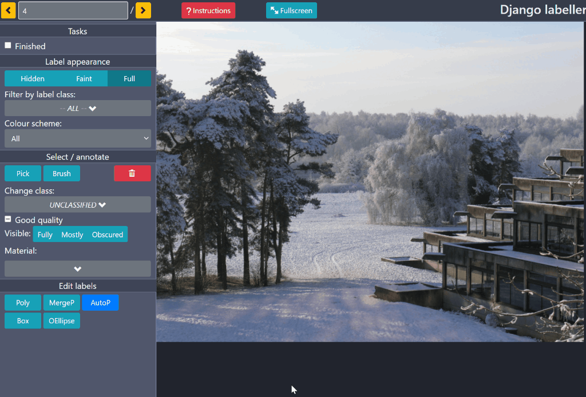
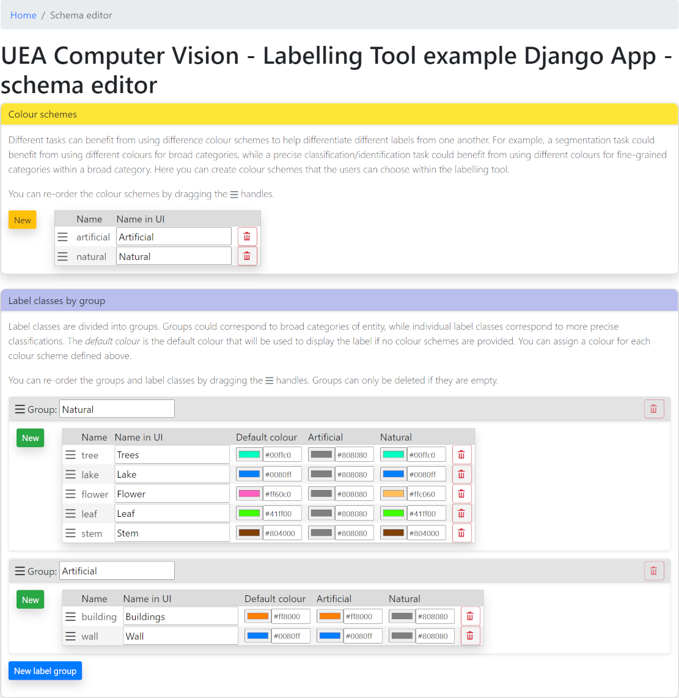

# Django Labeller

from: https://github.com/Britefury/django-labeller

#### A light-weight image labelling tool for Python designed for creating segmentation data sets.

- polygon, box, point and oriented ellipse annotations supported
- polygonal labels can have disjoint regions and can be editing using paintng and boolean operations; provided by
  [polybooljs](https://github.com/voidqk/polybooljs)
- can use the [DEXTR](http://people.ee.ethz.ch/~cvlsegmentation/dextr/) algorithm to automatically generate
  polygonal outlines of objects identified by the user with a few clicks; provided by the
  [dextr](https://github.com/Britefury/dextr) library
  
##### Django Labeller in action:


##### Schema editor:


## Installation

```shell script
> git clone https://github.com/ecoation-labs/django-labeller
> python setup.py install
```

## Examples

### Django web app example

The example Django-based web app provides a little more functionality than the Flask app. It stores the label
data in a database (only SQLite in the example) and does basic image locking so that multiple users cannot work
on the same image at the same time.

To initialise, first perform migrations:

```shell script
> python3 django-labeller/manage.py migrate
```

Now you need to import a labelling schema. Labelling schemes are stored as JSON files. For now, there is
a special one called `demo` that you can use. Load it into a schema named `default`:

```shell script
> python3 django-labeller/manage.py import_schema default demo
```

Then populate the database with the example images in the `images` directory (replace `images` with the path
of another directory if you wish to use different images):

```shell script
> python3 django-labeller/manage.py populate images
```

Then run the app:

```shell script
> python3 django-labeller/manage.py runserver
```

#### Django app with DEXTR assisted labelling

First, install the [dextr](https://github.com/Britefury/dextr) library and [celery](http://www.celeryproject.org/):

```shell script
> pip install dextr
> pip install celery
```

Now install [RabbitMQ](https://www.rabbitmq.com/), using the appropriate approach for your platform (you could use
a different Celery backend if you don't mind editing `settings.py` as needed). 

You can change the `LABELLING_TOOL_DEXTR_WEIGHTS_PATH` option to a path to a custom model, otherwise
the default ResNet-101 based U-net trained on Pascal VOC 2012 provided by the dextr library will be used.

Now run the Django application:

```shell script
> cd django-labeller
> python3 manage.py runserver
```

Now start a celery worker:

```shell script
> cd django-labeller
> celery -A example_labeller_app worker -l info
```

Note that Celery v4 and above are not strictly compatible with Windows, but it can work if you run:
```shell script
> celery -A example_labeller_app worker --pool=solo -l info
```


## API and label access

Please see the Jupyter notebook `Image labeller notebook.ipynb` for API usage. It will show you how to load
labels and render them into class maps, instance maps, or image stacks.

## Libraries, Credits and License

Incorporates the public domain [json2.js](https://github.com/douglascrockford/JSON-js) library.
Uses [d3.js](http://d3js.org/), [jQuery](https://jquery.com/), [popper.js](https://popper.js.org/),
[PolyK](http://polyk.ivank.net/), [polybooljs](https://github.com/voidqk/polybooljs),
[Bootstrap 4](https://getbootstrap.com/docs/4.0/getting-started/introduction/), 
[Vue.js v3](https://vuejs.org/) and [spectrum.js](https://bgrins.github.io/spectrum/).

This software was developed by Geoffrey French in collaboration with Dr. M. Fisher and
Dr. M. Mackiewicz at the [School of Computing Sciences](http://www.uea.ac.uk/computing)
at the [University of East Anglia](http://www.uea.ac.uk) as part of a project funded by
[Marine Scotland](http://www.gov.scot/Topics/marine).

It is licensed under the MIT license.
